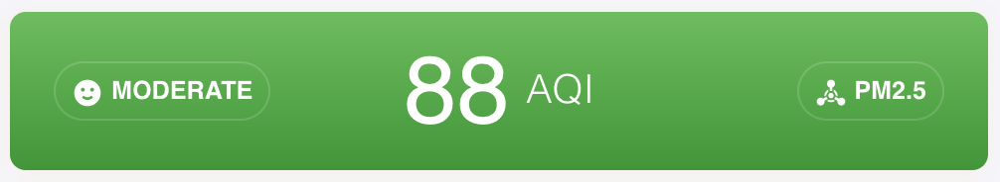
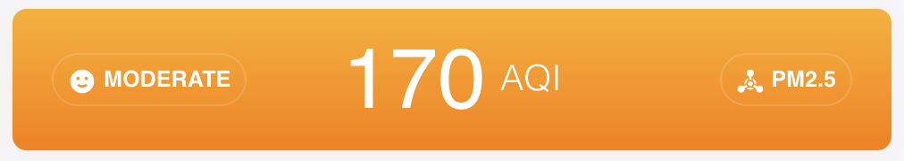
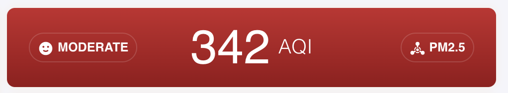

# Lovelace Nonow AQI

A custom [Lovelace](https://www.home-assistant.io/lovelace/) component for displaying an aqi for [Home Assistant](https://github.com/home-assistant/home-assistant).

Current version: **0.0.1**

## Screenshots





## Install

### Simple install

1. Download and copy [lovelace-nonow-aqi.js](https://raw.githubusercontent.com/brunosabot/lovelace-nonow-aqi/master/lovelace-nonow-aqi.js) into your `config/www` directory.

2. Add a reference to `lovelace-nonow-aqi.js` inside your `ui-lovelace.yaml`.

```yaml
resources:
  - url: /local/lovelace-nonow-aqi.js?v=0.0.1
    type: module
```

### Installation using Git

**Clone this repository into your `config/www` folder using git.**

```console
$ git clone https://github.com/brunosabot/lovelace-nonow-aqi.git
```

**Add a reference to the card in your `ui-lovelace.yaml`.**

```yaml
resources:
  - url: /local/lovelace-nonow-aqi/lovelace-nonow-aqi.js?v=1
    type: module
```

## Updating

1. Find your `lovelace-nonow-aqi.js` file in `config/www` or wherever you ended up storing it.

2. Replace the local file with the latest one attached in the here: [lovelace-nonow-aqi.js](https://raw.githubusercontent.com/brunosabot/lovelace-nonow-aqi/master/lovelace-nonow-aqi.js).

3. Change the version number with the new one to the end of the cards reference url in your `ui-lovelace.yaml` like below.

```yaml
resources:
  - url: /local/lovelace-nonow-aqi.js?v=0.0.2
    type: module
```

_You may need to empty the browsers cache if you have problems loading the updated card._

## Using the card

### Options

#### Card options

entity: input_datetime.bruno_birth
title: Bruno
type: 'custom:lovelace-nonow-aqi'

| Name      | Type    | Default      | Since  | Default | Description                  |
| --------- | ------- | ------------ | ------ | ------- | ---------------------------- |
| type      | string  | **required** | v0.0.1 |         | `custom:lovelace-nonow-aqi`  |
| index     | string  | **required** | v0.0.1 |         | A quality index **entity**   |
| level     | integer | **required** | v0.0.1 |         | A pollution level **entity** |
| pollutant | integer | **required** | v0.0.1 |         | A main pollutant **entity**  |

### Example usage

#### Simple usage

```yaml
- type: custom:lovelace-nonow-aqi
  index: sensor.u_s_air_quality_index
  level: sensor.u_s_air_pollution_level
  pollutant: sensor.u_s_main_pollutant
```

## License

This project is under the MIT licence
